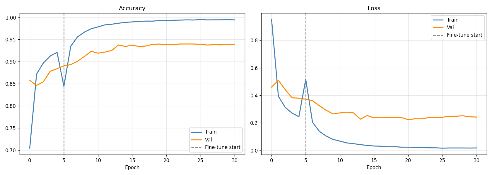

# 🤟 Sign Language Recognition System

A real-time **American Sign Language (ASL) Recognition System** developed using **Python, TensorFlow, Keras, and OpenCV**. The application captures hand gestures through a webcam and predicts the corresponding ASL alphabet using a trained deep learning model.

This project demonstrates the practical application of **Machine Learning**, **Deep Learning**, and **Computer Vision** to enable real-time sign language recognition.

---

# 📖 Overview

Communication through sign language is essential for many individuals with hearing or speech impairments. This project aims to bridge the communication gap by recognizing hand gestures in real time using a webcam and converting them into corresponding alphabet predictions.

The system uses a Convolutional Neural Network (CNN) trained on an ASL dataset. OpenCV captures live video frames, while TensorFlow/Keras performs gesture classification.

---

# ✨ Features

* Real-time webcam-based sign language recognition
* American Sign Language (ASL) alphabet prediction
* Deep learning model trained using TensorFlow/Keras
* Live prediction with confidence score
* Easy-to-use Python application
* Modular and extensible project structure
* Training performance visualization

---

# 🛠 Technologies Used

| Technology | Purpose                    |
| ---------- | -------------------------- |
| Python     | Programming Language       |
| TensorFlow | Deep Learning Framework    |
| Keras      | Neural Network Development |
| OpenCV     | Webcam & Image Processing  |
| NumPy      | Numerical Computation      |
| JSON       | Class Label Storage        |

---

# 📂 Project Structure

```text
sign-language-recognition/

├── realtime_sign.py          # Real-time sign language prediction
├── sign_lang_demo.py         # Demo application
├── best_asl_model.h5         # Trained ASL model
├── best_phase1.keras         # Intermediate trained model
├── best_sign_model.keras     # Final trained model
├── class_names.json          # Label mapping
├── training_curves.png       # Accuracy/Loss graph
├── requirements.txt
├── README.md
└── .gitignore
```

---

# ⚙️ Installation

### Clone the repository

```bash
git clone https://github.com/aryapatel19/sign-language-recognition.git
```

### Navigate into the project folder

```bash
cd sign-language-recognition
```

### Install the required libraries

```bash
pip install -r requirements.txt
```

---

# ▶️ Usage

Run the real-time recognition system:

```bash
python realtime_sign.py
```

or

```bash
python sign_lang_demo.py
```

Allow the application to access your webcam.

Show an ASL alphabet gesture in front of the camera.

The predicted alphabet will be displayed on the screen.

---

# 📊 Dataset

The dataset used for training is **not included** in this repository because of its size.

Dataset Used:

**ASL Alphabet Dataset**

You can download it from Kaggle:

https://www.kaggle.com/datasets/grassknoted/asl-alphabet

---

# 🧠 Model Information

### Model Architecture

* Convolutional Neural Network (CNN)

### Framework

* TensorFlow
* Keras

### Input

* Hand gesture image captured from webcam

### Output

* Predicted ASL alphabet

---

# 📈 Training Results

The CNN model was trained using the ASL Alphabet Dataset.

The graph below shows the training and validation accuracy/loss during training.



---

# ⚙️ Working Process

1. Capture live video from the webcam using OpenCV.
2. Detect and preprocess the hand region.
3. Resize the image according to the model input size.
4. Feed the processed image into the trained CNN model.
5. Predict the corresponding ASL alphabet.
6. Display the prediction on the video frame in real time.

---

# ⚠️ Limitations

* Supports only trained ASL alphabet gestures.
* Performance depends on lighting conditions.
* Background clutter may reduce prediction accuracy.
* Requires a webcam.
* Dataset is not included in the repository.

---

# 🚀 Future Improvements

* Word-level sign recognition.
* Sentence formation from continuous gestures.
* TensorFlow Lite implementation for mobile devices.
* Web application deployment.
* Android application.
* Improved accuracy using larger datasets.
* Dynamic gesture recognition.

---

# 📚 Learning Outcomes

Through this project, I gained practical experience in:

* Deep Learning
* Machine Learning
* Computer Vision
* TensorFlow
* Keras
* OpenCV
* CNN Architecture
* Image Classification
* Real-Time Prediction Systems
* Model Training & Evaluation

---

# 👤 Author

**Arya Patel**

GitHub: https://github.com/aryapatel19

---
# 📄 License

This project is intended for educational and learning purposes.

If you wish to reuse or modify the code, please provide appropriate credit to the original author.

---

